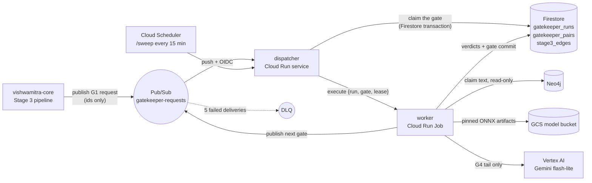

# lakshmana-core

**Lakshmana** is the Stage 3 *gatekeeper* of Vishwakarma AI: an LLM-free cascade of small
encoder models that judges claim pairs on CPU before an LLM ever sees them, with a capped LLM
escalation tail and a human review queue as the final backstop.

It replaces the Stage 3 pair-judge of [vishwamitra-core](https://github.com/vishwakarma-ai/vishwamitra-core),
which judged every candidate pair with a Gemini self-consistency ensemble (k=5) and accounted for
roughly $49 of a $56 proof-of-concept run. The cascade's cost target is **$2–5 per 1,000-claim
intake**, with no GPU anywhere.

Python 3.12 · [uv](https://docs.astral.sh/uv/) · ruff · pytest · ONNX Runtime (CPU) · Hugging Face
`tokenizers` · FastAPI · Google Cloud (Cloud Run, Pub/Sub, Firestore, GCS, Vertex AI) · Neo4j (read-only).

---

## Contents

- [What it does](#what-it-does)
- [How a run flows](#how-a-run-flows)
- [The gates](#the-gates)
- [Judge modes](#judge-modes)
- [Reliability design](#reliability-design)
- [Repository layout](#repository-layout)
- [The contract with vishwamitra](#the-contract-with-vishwamitra)
- [Running locally](#running-locally)
- [Configuration](#configuration)
- [Model artifacts](#model-artifacts)
- [Replay and calibration](#replay-and-calibration)
- [Operations](#operations)
- [Related repositories](#related-repositories)
- [License](#license)

---

## What it does

Vishwakarma's Stage 3 turns a ledger of extracted claims about a person into a scored evidence
graph. Its MATCH phase produces candidate claim **pairs** that need a verdict: does claim B
*repeat*, *corroborate*, *contradict*, or say nothing about claim A? At tens of thousands of pairs
per intake, an LLM per pair is the dominant cost of the whole pipeline.

Lakshmana routes each pair through a cascade of increasingly expensive judges and stops at the
first one that is confident:

```
G1_NEUTRAL  ->  G2_CORROBORATION  ->  G3_CONTRADICTION  ->  G4_ESCALATION  ->  FINALIZE
 NLI, both       grounding /          second-family        Gemini flash-lite,   totals +
 directions      support check        cross-check          one call per pair    reconciliation
 sees 100%       sees ~15-20%         sees a few %         target <= 5%, capped
```

Every verdict lands in Firestore with the full-precision scores that produced it, so thresholds
can be recalibrated offline without re-running inference. Contradictions are never finalised by
the cascade: a two-model agreement becomes a *candidate* in the human review queue, exactly as
the LLM judge handled them.

## How a run flows



Three runtime pieces live in this one package:

| Piece | Runs as | Job |
| --- | --- | --- |
| **dispatcher** (`gatekeeper.dispatcher`) | Cloud Run service, 1 vCPU / 512 MB, scales to zero | Verifies the OIDC token and schema, claims the gate in one Firestore transaction, starts a worker execution, ACKs within seconds. Duplicate and stale messages are ACKed as no-ops. |
| **worker** (`gatekeeper.worker`, entrypoint `gatekeeper-worker`) | Cloud Run Job, 4 vCPU / 8 GB, up to 6 h per task | Executes exactly one gate for one run: loads the pinned model, hydrates claim text from Neo4j, scores, writes verdicts, commits the gate, then publishes the next gate's message. |
| **sweeper** (`POST /sweep` on the dispatcher) | Cloud Scheduler, every 15 minutes | Rescues crashes, never failures: expired gate leases go back to `PENDING` and are republished (three attempts, then the run fails with `GK_E_STUCK`); runs idle past a grace period get their pending gate re-sent; DLQ depth is surfaced. |

External services only ever publish the **G1** message. After that the chain drives itself:
each worker commits its gate and publishes the next one. FINALIZE is not a gate. It is the last
thing the G4 worker does: recompute the run totals from the pair queue, verify that
`decidedByGates + escalatedLlm + escalatedHuman == pairsSeen`, mark the run `SUCCEEDED`, and
publish nothing. Vishwamitra's existing poll observes the run document and advances its own
lifecycle.

## The gates

Every gate slot is model-agnostic. The artifact id, its integrity pin, and every threshold are
read from the run's frozen `configSnapshot`, so swapping a model is a configuration change.

| Gate | Sees | Model (v1 roster) | Decides | Forwards or escalates |
| --- | --- | --- | --- | --- |
| **G1_NEUTRAL** | 100% of pairs | `tasksource/ModernBERT-base-nli`, scored in both directions | `NEUTRAL`, `REPEATS` | Any contradiction signal above the escape threshold is flagged and can never be discarded as neutral. A bare-vs-in-context disagreement escalates to G4. Everything else goes to G2. |
| **G2_CORROBORATION** | G1 leftovers | `lytang/MiniCheck-DeBERTa-v3-Large` | `CORROBORATES` | Scores claim-vs-claim in both directions and, when the paired claim's source excerpt exists, claim-vs-evidence (*grounding mode*, an input the LLM judge never had). Flagged pairs pass through without inference. Undecided pairs go to G3. |
| **G3_CONTRADICTION** | Flagged pairs + G2 leftovers | `MoritzLaurer/DeBERTa-v3-base-mnli-fever-anli`, cross-checked against G1's scores read back from the edge row | `NEUTRAL` on two-family consensus | Two-family agreement on contradiction routes the pair to the **human queue** as a `CONTRADICTS` candidate. Disagreement escalates to G4. |
| **G4_ESCALATION** | Target ≤ 5%, hard cap `maxLlmPairs` (3,000) | Gemini 2.5 flash-lite, one call per pair, minimal thinking budget | Verdict plus a short rationale | Parse failures, quota errors, and the over-cap remainder go to the human queue with an explicit `escalationReason`. A failed call costs its pair, never the gate. |
| **FINALIZE** | — | — | Run totals, `SUCCEEDED` | Publishes nothing. A stranded pair fails the run loudly rather than blessing a verdict set with a hole in it. |

Cross-architecture agreement at G3 replaces the old five-vote self-consistency: one model can be
confidently wrong five times, two models from different training lineages agreeing is a different
kind of evidence. The gate decision rules themselves are pure functions in
`gatekeeper/gates/decisions.py`, which is what lets the replay bake-off measure the production
gates rather than a re-implementation of them.

## Judge modes

The mode is pinned into vishwamitra's `Stage3Run.paramsSnapshot` at run start and read from there
by both services, so a mode change can never affect an in-flight run.

| Mode | Cascade | LLM ensemble | Verdict writer | Purpose |
| --- | --- | --- | --- | --- |
| `LLM` | not invoked | decides | vishwamitra | legacy path and rollback target |
| `SHADOW` | full run, G4 makes no calls | decides | vishwamitra (cascade writes `shadow.*` only) | live disagreement report before cutover |
| `GATEKEEPER` | decides | must not run | lakshmana + human queue | end state |

In `GATEKEEPER` mode the cascade's verdicts are authoritative, so a G4 tail backed by the dry-run
double refuses with `GK_E_G4_DRYRUN` before writing a single verdict. The double stays available
where fabrication is harmless: local tests and `SHADOW`.

## Reliability design

- **At-least-once, unordered delivery is neutralised by transactions.** Every Pub/Sub message is
  only an *attempted* transition; a Firestore transaction on `gatekeeper_runs` decides, and losers
  are ACKed and dropped. `runRequestId` is the idempotency root.
- **Commit, then publish.** A gate's result is durable before the next gate's message exists. A
  crash in the window costs a sweeper rescue, never a double run.
- **Leases with a heartbeat.** Gates hold a 90-minute lease and renew it once per batch; a worker
  whose lease was swept learns it has lost the gate and stops before writing. Routing writes are
  guarded per pair against the live row, so a straggler can neither strand a pair nor regress one a
  later gate settled.
- **Frozen calibration per run.** Models and thresholds are snapshotted into the run document at
  creation; every gate and every `FROM_GATE` resume reads the snapshot, never live config.
- **Pinned artifacts.** Each gate's config carries the sha256 of its artifact manifest, and the
  manifest carries a digest per file. A mismatch is `GK_E_MODEL_FETCH`, never a silent fallback to
  whatever is on disk.
- **Label order is verified, not assumed.** NLI heads disagree on which logit column is
  contradiction; an unmappable `id2label` is a hard error, because a wrong mapping would silently
  discard contradictions as neutral.
- **Deterministic ids everywhere.** Pair rows are keyed `{stage3RunId}|{claimIdLow}|{claimIdHigh}`
  and verdict rows mirror vishwamitra's own key, so every write is an idempotent upsert.
- **Claim text never transits Pub/Sub.** Messages carry ids only; text is hydrated from the graph
  per batch. Graph access is read-only by construction (an RBAC user server-side, a read-only
  session client-side).

Error codes (`GK_E_*`) are the contract between the code, the run document, and the runbook:

| Code | Meaning | Handling |
| --- | --- | --- |
| `GK_E_SCHEMA` | unknown `schemaVersion` or malformed payload | 400, never guessed; five attempts send it to the DLQ |
| `GK_E_MODEL_FETCH` | artifact missing or digest mismatch | gate `FAILED`; fix the manifest, retrigger `FROM_GATE` |
| `GK_E_NEO4J_UNAVAILABLE` | hydration failures beyond the retry budget | gate `FAILED`; usually a retrigger |
| `GK_E_FIRESTORE_TXN` | claim or commit contention beyond retries | gate `FAILED` |
| `GK_E_VERTEX` | G4 quota or 5xx beyond backoff | affected pairs to the human queue; gate still `SUCCEEDED` |
| `GK_E_CAP_EXCEEDED` | G4 `maxLlmPairs` reached | remainder drained to the human queue at zero cost; run `SUCCEEDED` with a warning |
| `GK_E_G4_DRYRUN` | a deciding run reached G4 with the dry-run double | gate `FAILED`; enable live calls or run `SHADOW` |
| `GK_E_STUCK` | sweep attempts exhausted | run `FAILED`; see the runbook |

## Repository layout

```
gatekeeper/
  config.py          settings catalogue: kebab-case keys, GATEKEEPER_* env overrides, configSnapshot paths
  enums.py           gates, run/gate states, judge modes, verdicts, escalation reasons, queue tiers
  errors.py          GK_E_* error codes as exception types
  contracts/         the wire payload codec and the Pub/Sub push envelope
  dispatcher/        FastAPI app (/healthz, /pubsub/push, /sweep), OIDC verification, job launch, sweeper
  worker/            worker entrypoint, gate registry and context, hydration, pair queue, verdict writes, FINALIZE
  gates/             G1–G4 plumbing, the pure decision functions, the G4 prompt
  scoring/           batched ONNX Runtime inference over (premise, hypothesis) pairs
  models/            artifact roster, manifest pin chain, GCS/local loader with atomic on-disk cache
  runs/              gatekeeper_runs document model and transactional state machine
  replay/            corpus export, score-once/sweep-many bake-off, metrics and the GO bar
  clients/           Firestore, Neo4j (read-only), Pub/Sub, Vertex generateContent
  integration.py     reads of vishwamitra-owned data (stage3_runs, judgeMode)
contracts/
  gatekeeper_run_request.proto   the one message that crosses the repo boundary
  fixtures/                      golden fixtures pinned by both the Python and Kotlin sides
scripts/
  prepare_models.py        Hugging Face -> ONNX -> INT8 -> sanity diff -> GCS mirror (owner-run)
  probe_label_order.py     measure each NLI artifact's output column order
  export_replay_corpus.py  export ensemble-labelled pairs from a restored Firestore backup
  replay_bakeoff.py        threshold sweep over cached scores, zero LLM spend
  generate_fixtures.py     regenerate the golden contract fixtures
tests/                     unit tests plus emulator-backed integration tests (markers: emulator, neo4j)
Dockerfile.dispatcher      thin service image
Dockerfile.worker          job image; model artifacts are fetched at runtime, never baked in
RUNBOOK.md                 operating the cascade: first response, run-doc reading, symptom to action
```

## The contract with vishwamitra

One message crosses the boundary, `GatekeeperRunRequest`, defined in
[`contracts/gatekeeper_run_request.proto`](contracts/gatekeeper_run_request.proto): a schema
version, the run request id, the intake and Stage 3 run ids, the gate, the mode (`FULL` or
`FROM_GATE`), who triggered it, and a timestamp. Nothing else. Neither repository generates code
from the proto; both hand-write the mapping and pin the same bytes with the golden fixtures in
[`contracts/fixtures/`](contracts/fixtures/). CI regenerates the fixtures and fails on any diff, so
the serializer cannot drift from the contract unnoticed.

Data ownership is equally narrow. Lakshmana owns `gatekeeper_runs` (immutable history, one
document per run request) and `gatekeeper_pairs` (its routing queue). It is an additive writer in
vishwamitra's `stage3_edges`, creating only rows whose `method` is one of its own `GK_*` values and
purging only those on a fresh run. Everything else it reads.

## Running locally

Prerequisites: Python 3.12, `uv`, Docker. The suite never reaches Neo4j, Vertex, or real GCP.

```bash
uv sync
uv run ruff check . && uv run ruff format --check .
```

Most integration tests need the Firestore emulator, because the state machine is only
meaningfully tested against real transaction semantics:

```bash
docker run -d --name firestore-emulator -p 8082:8082 \
  gcr.io/google.com/cloudsdktool/google-cloud-cli:emulators \
  gcloud emulators firestore start --host-port=0.0.0.0:8082

FIRESTORE_EMULATOR_HOST=127.0.0.1:8082 uv run pytest
```

Set `GATEKEEPER_REQUIRE_EMULATOR=1` to turn an unreachable emulator into a failure instead of a
skip (CI does). The full cascade runs end to end against the emulator with a dry-run tail:

```bash
FIRESTORE_EMULATOR_HOST=127.0.0.1:8082 uv run pytest tests/test_e2e_cascade.py -q
```

The two runtime entrypoints:

```bash
# dispatcher
uv run uvicorn gatekeeper.dispatcher.app:app --port 8080

# worker: one gate of one run, the three variables the dispatcher would set on a job execution
GATEKEEPER_RUN_REQUEST_ID=<uuid> GATEKEEPER_GATE=G1_NEUTRAL GATEKEEPER_LEASE_OWNER=<lease> \
  uv run gatekeeper-worker
```

Images build without pushing, as CI does:

```bash
docker build -f Dockerfile.dispatcher -t gatekeeper-dispatcher .
docker build -f Dockerfile.worker -t gatekeeper-worker .
```

Live Vertex calls are off by default (`GATEKEEPER_G4_LIVE_CALLS` unset), so nothing local spends
money. A `GATEKEEPER`-mode run therefore refuses at G4; run `SHADOW` or inject a double to
exercise the tail without Vertex.

## Configuration

Keys are kebab-case with `GATEKEEPER_*` environment overrides. Anything that shapes a verdict is
also written into the run's `configSnapshot`. Selected settings:

| Environment variable | Default | Role |
| --- | --- | --- |
| `GATEKEEPER_G1_MODEL` / `_G2_MODEL` / `_G3_MODEL` | `modernbert-base-nli@v1` / `minicheck-deberta-l@v1` / `deberta-mnli-fever-anli@v1` | artifact id per gate |
| `GATEKEEPER_G1_SHA256` / `_G2_SHA256` / `_G3_SHA256` | empty | sha256 of the artifact manifest; the integrity pin |
| `GATEKEEPER_G1_NEUTRAL_MIN` / `_G1_REPEAT_MIN` / `_G1_CONTRA_ESCAPE` | `0.95` / `0.90` / `0.02` | G1 thresholds; the escape threshold is the contradiction safety hatch |
| `GATEKEEPER_G2_SUPPORT_MIN` / `_G2_GROUNDING_MODE` | `0.90` / `AUTO` | G2 threshold; `AUTO` grounds every pair that has a source excerpt, `OFF` never |
| `GATEKEEPER_G3_CONTRA_MIN` / `_G3_NEUTRAL_CONSENSUS` | `0.85` / `0.10` | G3 two-family thresholds |
| `GATEKEEPER_G4_LLM_MODEL` / `_G4_MAX_LLM_PAIRS` / `_G4_THINKING_BUDGET` | `gemini-2.5-flash-lite` / `3000` / `512` | the tail's model, hard cap, and thinking budget |
| `GATEKEEPER_G4_LIVE_CALLS` | `false` | selects the real Vertex door; required for a `GATEKEEPER`-mode run |
| `GATEKEEPER_JUDGE_MODE_DEFAULT` | `GATEKEEPER` | applied when the Stage 3 run carries no mode |
| `GATEKEEPER_LEASE_GATE_MINUTES` / `_QUEUE_LEASE_MINUTES` / `_QUEUE_BATCH_SIZE` | `90` / `15` / `32` | gate lease, pair lease, batch size |
| `GATEKEEPER_SWEEP_MAX_ATTEMPTS` / `_SWEEP_REQUESTED_GRACE_MINUTES` | `3` / `30` | sweeper budget and idle grace |
| `GATEKEEPER_FIRESTORE_PROJECT_ID` / `_FIRESTORE_DATABASE` | empty / `(default)` | Firestore target; production uses a named database |
| `GATEKEEPER_PUBSUB_TOPIC` / `_PUBSUB_DLQ_SUBSCRIPTION` | `gatekeeper-requests` / `gatekeeper-requests-dlq-pull` | topic and DLQ inspection subscription |
| `GATEKEEPER_DISPATCHER_REQUIRE_OIDC` / `_OIDC_AUDIENCE` / `_ALLOWED_SERVICE_ACCOUNTS` | `true` / empty / empty | push and scheduler authentication |
| `GATEKEEPER_WORKER_JOB_NAME` / `_WORKER_JOB_REGION` / `_WORKER_EXECUTE_JOBS` | `gatekeeper-worker` / `asia-southeast1` / `false` | the Cloud Run Job the dispatcher executes |
| `GATEKEEPER_MODELS_BUCKET` / `_MODELS_LOCAL_DIR` / `_MODELS_CACHE_DIR` | empty / empty / `/tmp/gatekeeper-models` | artifact source (a local dir laid out like the bucket wins when set) and on-disk cache |
| `GATEKEEPER_NEO4J_URI` / `_NEO4J_USER` / `_NEO4J_PASSWORD` / `_NEO4J_DATABASE` | `bolt://localhost:7687` / `neo4j` / empty / `neo4j` | read-only graph access; the password is masked in logs |

The full catalogue, with the `configSnapshot` path of every setting, is `gatekeeper/config.py`.

## Model artifacts

The runtime never talks to Hugging Face. Checkpoints are mirrored once, by an operator, with
`scripts/prepare_models.py` (install the `model-prep` extra first):

```
Hugging Face  ->  ONNX (fp32)  ->  dynamic INT8  ->  sanity diff against fp32  ->  GCS
```

The sanity diff is the step that earns its keep: a quantized encoder that has lost its calibration
does not crash, it returns confident, plausible, wrong probabilities. Every export is scored
against its own fp32 parent on the fixed 50-pair fixture in `contracts/fixtures/`, and INT8 ships
only if it clears the thresholds. As of the last mirror, none of the seven candidate checkpoints
did, so artifacts ship fp32.

Bucket layout: `<name>/<version>/<precision>/{model.onnx,tokenizer.json,config.json}` with one
`manifest.json` per `<name>/<version>`. The loader fetches lazily per gate, verifies every digest,
and renames files into its cache only after all of them match, so a killed task cannot leave a
half-written model that looks cached. `GATEKEEPER_MODELS_LOCAL_DIR` points the same loader at a
local directory, which is how the bake-off runs the production loader before anything reaches GCS.

`scripts/probe_label_order.py` measures each artifact's logit column order against the labelled
fixture rather than trusting `config.json`, because the roster genuinely disagrees with itself.

## Replay and calibration

Because every gate decision is a pure function over scores and thresholds, calibration needs no
new labels and no LLM spend:

1. `scripts/export_replay_corpus.py` exports the pairs the previous LLM ensemble already judged,
   with its verdicts and per-vote detail, from a Firestore backup restored into a separate emulator.
2. `scripts/replay_bakeoff.py` scores every candidate artifact over every pair exactly once, caches
   the raw probabilities, and re-runs the production decision functions over them for as many
   threshold combinations as the sweep asks. A hundred-point sweep costs one inference pass.
3. The GO bar in `gatekeeper/replay/metrics.py` treats escalation as deferral rather than error,
   measures neutral coverage over the whole corpus, and defines contradiction recall as "did not
   discard".

**Current status.** Measured on a 12,208-pair corpus from a single reference subject, the shipped
G1 rule, which consults the model's *neutral* head, did not clear the bar. The usable signal turned
out to be the same model's *contradiction* head: one model and one threshold reach roughly 66%
neutral coverage at 95% precision, against 28% at 78% for the shipped rule. The one-feature gate
is pending a cold re-measurement on a held-out second subject before it replaces the defaults, and
the G4 cap and cost model are being re-set for the larger escalation tail it implies. The defaults
in `config.py` are the as-built proposal until then.

## Operations

`RUNBOOK.md` is the operating manual: first response, reading the run document, symptom to action,
the error-code table, alerts, log filters, dead-letter replay, retrigger, and local reproduction.

`gatekeeper_runs` is the single source of truth. Every log line is structured JSON carrying
`runRequestId` and `gate`, and a handful of `event` fields are a contract with log-based metrics:
`gate_committed` (with `durationMs`), `run_finalized` (with flat pair, escalation, and spend
counts), `run_overdue`, and any `errorCode` of `GK_E_*`. Alerts sit on DLQ depth, job execution
failures, runs `RUNNING` past two hours, the G4 cap, and dispatcher 5xx rate.

Re-runs come in two shapes. `FROM_START` mints a new run request id and begins with a purge of
this run's gatekeeper-written verdicts; earlier judges' rows are never touched. `FROM_GATE` re-enters
at one failed gate and keeps everything before it. Failures are decisions, not crashes: the sweeper
never retries a `FAILED` gate, an operator does.

## Related repositories

- [vishwamitra-core](https://github.com/vishwakarma-ai/vishwamitra-core): the Kotlin labelling
  and training console that owns Stages 1–4, publishes the G1 request, and polls `gatekeeper_runs`.
- `lakshmana-infra`: the Terraform for the dispatcher service, worker job, topic and DLQ, scheduler,
  model bucket, and IAM.

## License

[MIT](LICENSE).
